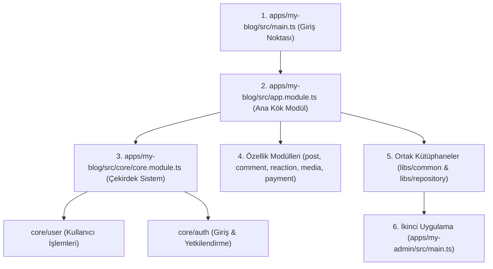

# 🏗️ Büyük Ölçekli NestJS Mimarisi (Monorepo & Multi-App Guide)

Bu proje, videodaki (**Tech Vision - How a Large Scale NestJS App Should ACTUALLY Look**) mimari prensiplere %100 sadık kalınarak hazırlanmıştır. Öğrenme sürecinizi kolaylaştırmak adına kodlar **en anlaşılır ve temiz** şekilde yazılmıştır.

---

## 🎯 1. `libs` (Libraries) Nedir ve Neden Kullanılır?

Büyük ölçekli (Large-Scale) projelerde tek bir uygulama yerine birden fazla uygulama olur. Örneğin:
* 🌐 `apps/my-blog` (Son kullanıcıların girdiğinde gördüğü blog sitesi)
* 🔐 `apps/my-admin` (Yöneticilerin kullandığı admin paneli)

Eğer `my-blog` ve `my-admin` projelerinin ikisinde de aynı **Auth Guard**, **Logger Middleware**, **User Decorator** veya **Veritabanı (Repository)** kodlarına ihtiyacınız varsa:
❌ **Yanlış Yaklaşım:** Kodları kopyalayıp her iki projenin içine ayrı ayrı yapıştırmak.  
✅ **Profesyonel Yaklaşım (`libs`):** Ortak kodları `libs/common` veya `libs/repository` içine koymak.

Böylece tek bir komutla hem `my-blog` hem `my-admin` içerisinde:
```typescript
import { ContextProvider, User } from '@app/common';
import { RepositoryService } from '@app/repository';
```
şeklinde sıfır kod tekrarı ile kütüphaneyi çağırabilirsiniz.

---

## 📖 2. Kodları Hangi Sırayla Okumalısınız? (Öğrenci Okuma Rehberi)

Projeyi ilk defa incelerken tam olarak şu sırayı takip ediniz:



### 🔹 Sıra 1: `apps/my-blog/src/main.ts`
Uygulamanın çalışmaya başladığı ilk dosyadır. `NestFactory.create(AppModule)` ile NestJS sunucusunu 3000 portunda başlatır.

### 🔹 Sıra 2: `apps/my-blog/src/app.module.ts`
Uygulamanın orkestra şefidir. İçerisinde `CoreModule`, `PostModule`, `CommentModule`, `ReactionModule`, `MediaModule`, `PaymentModule` ve `ConfigModule` gibi tüm modülleri bir araya getirir.

### 🔹 Sıra 3: `apps/my-blog/src/core/core.module.ts`
Sistemin **en temel (çekirdek)** ihtiyaçlarını gruplar.
* `core/user`: Kullanıcı verileri ve servisi.
* `core/auth`: Giriş yapma (login) ve `AuthGuard` güvenlik mekanizması.

### 🔹 Sıra 4: Özellik Modülleri (Feature Modules)
Her biri tek bir işten sorumlu bağımsız modüllerdir:
* 📝 `post/`: Blog yazıları.
* 💬 `comment/`: Yorumlar.
* ❤️ `reaction/`: Beğeniler (Like/Love).
* 🖼️ `media/`: Resim/Dosya yükleme.
* 💳 `payment/`: Ödeme alma.
* ⚙️ `config/`: Sistem ayarları.

### 🔹 Sıra 5: `libs/` (Ortak Kütüphaneler)
* `libs/common/src/`:
  * `@decorators/user.decorator.ts`: Parametre bazlı custom decorator.
  * `filters/http-exception.filter.ts`: Hata yakalama filtresi.
  * `guards/roles.guard.ts`: Rol kontrol koruyucusu.
  * `middlewares/logger.middleware.ts`: Gelen istekleri loglayan ara yazılım.
  * `providers/context.provider.ts`: İstek bağlamı sağlayıcı.
* `libs/repository/src/`: Tüm veritabanı sorgularının tutulduğu soyut katman.

### 🔹 Sıra 6: `apps/my-admin/`
Ana blog projesinden bağımsız çalışan yönetim paneli uygulaması. `libs/common` ve `libs/repository` kütüphanelerini import ederek çalışır.

---

## 💻 3. Projeyi Çalıştırma ve Komut Rehberi

Global Nest CLI yüklemeden **`npx`** ile projeyi şu komutlarla çalıştırabilirsiniz:

### 🚀 Uygulamaları Çalıştırma:
```bash
# Blog Uygulamasını Başlat (Port 3000):
npx nest start my-blog --watch

# Admin Uygulamasını Başlat:
npx nest start my-admin --watch
```

### 📦 Yeni Modül & Kütüphane Ekleme Komutları:
```bash
# Blog içine yeni bir modül eklemek için:
npx nest g module my-module --project my-blog

# Yeni bir kütüphane (lib) oluşturmak için:
npx nest g lib my-library

# Yeni bir uygulama (app) eklemek için:
npx nest g app my-new-app
```


____________________________
# 📂 Projenizde Oluşturulan Mimari Yapı

```text
largeScaleNstJsApp/
├── apps/
│   ├── my-blog/                          # 🌐 Ana Blog Uygulaması
│   │   └── src/
│   │       ├── core/                     # 🔐 Çekirdek (Core) Modüller Katmanı
│   │       │   ├── auth/                 # AuthController, AuthService, AuthGuard, AuthModule
│   │       │   ├── user/                 # UserController, UserService, UserModule
│   │       │   └── core.module.ts        # CoreModule (User & Auth bir arada)
│   │       ├── post/                     # 📝 PostModule, PostController, PostService
│   │       ├── comment/                  # 💬 CommentModule, CommentController, CommentService
│   │       ├── reaction/                 # ❤️ ReactionModule, ReactionController, ReactionService
│   │       ├── media/                    # 🖼️ MediaModule, MediaController, MediaService
│   │       ├── payment/                  # 💳 PaymentModule, PaymentController, PaymentService
│   │       ├── config/                   # ⚙️ ConfigModule, ConfigService
│   │       ├── app.module.ts             # Tüm modüllerin toplandığı Kök Modül
│   │       └── main.ts                   # Uygulama Başlangıç Noktası
│   │
│   └── my-admin/                         # 🛠️ İkinci Uygulama (Admin Paneli)
│       └── src/
│           ├── my-admin.module.ts        # @app/common ve @app/repository kullanan admin modülü
│           └── main.ts
│
└── libs/                                 # 📦 Ortak Kütüphaneler (Shared Libraries)
    ├── common/                           # Ortak Yardımcılar Katmanı
    │   └── src/
    │       ├── decorators/               # user.decorator.ts
    │       ├── filters/                  # http-exception.filter.ts
    │       ├── guards/                   # roles.guard.ts
    │       ├── middlewares/              # logger.middleware.ts
    │       ├── providers/                # context.provider.ts
    │       └── index.ts                  # @app/common export dosyası
    │
    └── repository/                       # Veritabanı Soyutlama Katmanı
        └── src/
            ├── repository.service.ts
            └── repository.module.ts
```

---

## 🎙️ Sesli Mesajlarınızdaki Soruların Yanıtları

### 1. `libs` (Libraries) Nedir ve Niye Ekliyoruz?
Monorepo mimarisinde aynı proje klasörü içerisinde birden fazla uygulama yer alır (Örn: `my-blog` ve `my-admin`).

Hem blog uygulamasında hem de admin uygulamasında **Auth Guard**, **Kullanıcı Decorator'ı**, **Logger Middleware** veya **Veritabanı işlemleri (Repository)** kullanılır.
* **`libs` kullanılmazsa:** Bu kodları kopyalayıp her iki projenin içine ayrı ayrı yapıştırmanız gerekir (Kötü yöntem).
* **`libs` kullanılırsa:** Ortak olan tüm kodlar `libs/common` ve `libs/repository` klasörlerine konur. Hem `my-blog` hem `my-admin` sadece `import { ... } from '@app/common'` yazarak bu kodları sıfır kod tekrarı ile kullanır!

---

### 2. Bir Öğrenci Olarak Kodları Hangi Sırayla Okumalısınız?

`README.md` ve `MimariPayi.md` dosyalarınızdaki sıralama şu şekildedir:

1. 🚀 **`apps/my-blog/src/main.ts`** *(Sunucuyu başlatan dosya)*
2. 🎼 **`apps/my-blog/src/app.module.ts`** *(Tüm modülleri birleştiren orkestra şefi)*
3. 🔐 **`apps/my-blog/src/core/core.module.ts`** *(Sistemin bel kemiği olan Auth ve User modülleri)*
4. 🧱 **Özellik Modülleri:** `post`, `comment`, `reaction`, `media`, `payment`, `config`
5. 📦 **Ortak Kütüphaneler:** `libs/common` ve `libs/repository`
6. 🛠️ **İkinci Uygulama:** `apps/my-admin`

---

## 💻 Uygulamaları Çalıştırma Komutları

```bash
# Blog Uygulamasını Çalıştır:
npx nest start my-blog --watch

# Admin Uygulamasını Çalıştır:
npx nest start my-admin --watch
```
